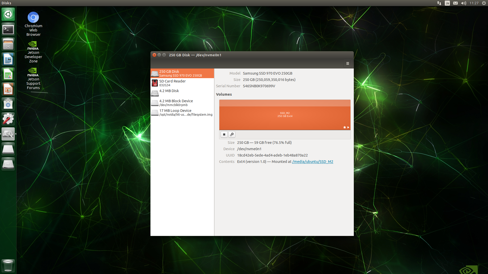

<a name='top'>
# Jetson TX2 セットアップ
<hr>

## 【目標】
Jetson TX2にSSDを搭載して、DockerでAutoware 1.9.1をインストールする。<br>

## 【構成思想】
ハードウェア | 理由
-- | --
Jetson TX2 | ラジコンに搭載可能なサイズのため
NVMe M.2 SSD | LiDAR情報をROSBAGで保存する際に、容量と書き込み速度の確保のために必要
NVMe M.2 to PCIe x4 Adapter | Jetson TX2のM.2スロットはWiFiカード用のKey Eであり、NVMe SSDのKey Mは認識しない。Jetson TX2にNVMe M.2 SSDを搭載するために必要


## 【必要なもの】
* Jetson TX2<br>
  * JetPack 3.3/L4T 28.2.1<br>
  * NVMe M.2 SSD<br>
  * NVMe M.2 to PCIe x4 Adapter<br>
<hr>

## 【画像】


## JetPack 3.3/L4T 28.2.1
インストール方法はNVIDIAが公開しているためそれに従ってインストールを行う。<br>
URL:<br>
[https://devtalk.nvidia.com/default/topic/1037811/jetson-tx2/jetpack-3-3-mdash-l4t-r28-2-1-release-for-jetson-tx1-tx2/](https://devtalk.nvidia.com/default/topic/1037811/jetson-tx2/jetpack-3-3-mdash-l4t-r28-2-1-release-for-jetson-tx1-tx2/)

## 【NVMe M.2 SSD】
### 装着
アダプターに装着してPCIe x4スロットに差し込む。<br>
ラジコン走行時の振動で接触しなくなることがあるため、適当にテープで止めておく。<br>
アダプターの青色LEDがまぶしいので適当に紙を貼っておく。<br>

### マウント
GUIディスク管理ツールの`disks`を起動して、SSDのマウント先が<br>
`/media/ubuntu/SSD_M2`<br>
となるように設定してください。<br>
また、Jetson TX2が起動すると、自動的にマウントされるように設定してください。





## 【DockerのディレクトリをSSDに変更】
docker.serviceファイルを編集して、デフォルトディレクトリパスがSSDになるようにします。<br>
### dockerを停止
```
sudo service docker stop
```

### docker.serviceを編集
```
sudo vi /lib/systemd/system/docker.service
```
before:<br>
```
ExecStart=/usr/bin/dockerd -H fd://
```
after:<br>
```
ExecStart=/usr/bin/dockerd -H fd:// -g /media/ubuntu/SSD_M2/docker
```

### 設定をリロード
```
sudo systemctl daemon-reload
```

### dockerサービス起動
```
sudo service docker start
```


## 【MAX-Nモード】
Jetson TX2にはパフォーマンスと消費電力を切り替えるためのモードが用意されています。<br>
その中で最大パフォーマンスとなるモードがMAX-Nモードになります。<br>

TX2をMAX-Nモードにする<br>
```
sudo nvpmodel -m 0
sudo /home/ubuntu/jetson_clock.sh
```
再起動後も動作モードは維持されますが、動作クロックは省エネモードになるため、動作クロックを最大に設定します。
```
sudo /home/ubuntu/jetson_clock.sh
```

## 【Xauthority】
AutowareではGUIを使うので、Dockerでデスクトップ画面を利用するためにセキュリティ設定を行います。<br>
### ubuntuユーザ
```
touch $HOME/.docker.xauth
xauth nlist $DISPLAY | sed -e 's/^..../ffff/' | xauth -f $HOME/.docker.xauth nmerge -
```

### rootユーザ
```
sudo su
touch $HOME/.docker.xauth
xauth nlist $DISPLAY | sed -e 's/^..../ffff/' | xauth -f $HOME/.docker.xauth nmerge -
```
