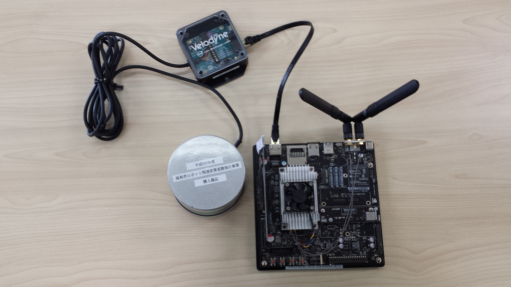
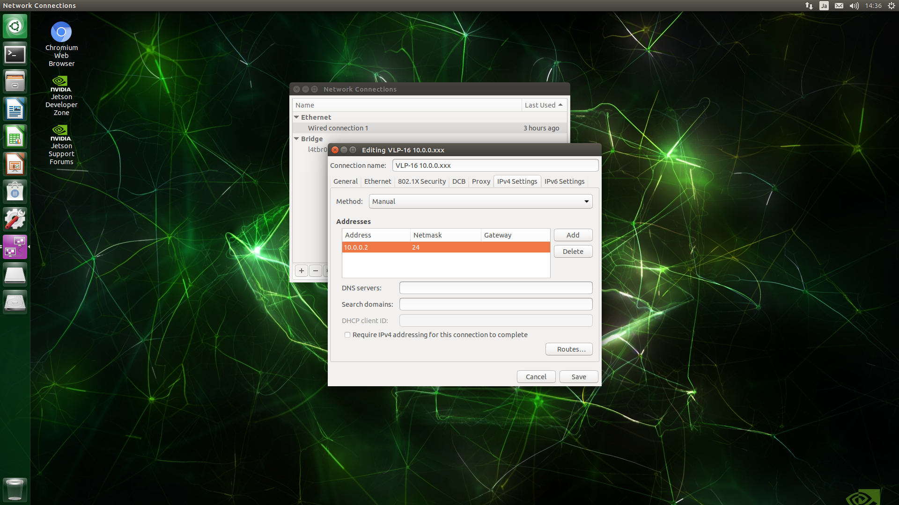
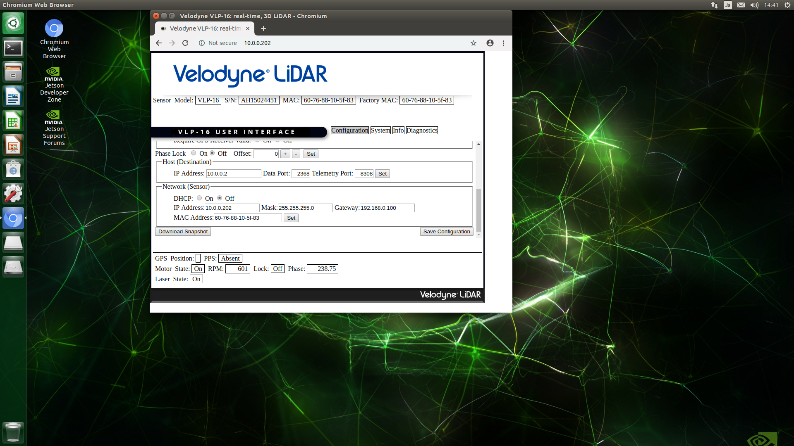

# VLP-16 ネットワーク設定
<hr>

## 【目標】
Velodyne VLP-16をROSで利用できることを確認する。

## 【必要なもの】
* Velodyne VLP-16<br>
* Autoware用のTX2、もしくはROS KineticをインストールしたPC
<hr>

## 【画像】

<hr>

## 【Ubuntuネットワーク作成】
UbuntuからVLP-16にアクセスするためのネットワークを作成します。<br>
PCのIPアドレスを10.0.0.2に固定にします。<br>

WiFiをインターネットに接続し、LANをVLP-16に接続した状態にします。<br>
TX2のWiFiは非常に遅いため、インターネット用のLANも作成しておくと便利です。<br>
データ転送時間：WiFi 1時間 -> LAN 10分に短縮<br>

## 【VLP-16設定】
VLP-16の工場出荷時の設定では、マルチキャスト配信になっています。<br>
これは家庭用NECルータでは処理できず、ネットワークがダウンしてしまうため、10.0.0.2に対してセンサー情報を流すように設定します。<br>

設定後、VLP-16の電源を入れ直します。<br>

ネットワーク上にVLP-16があることを確認します。<br>
```
sudo apt-get install arp-scan
sudo arp-scan -l
```
> 10.0.0.202	60:76:88:10:5f:83	Velodyne<br>


## 【VLP-16 製品仕様】
[https://www.argocorp.com/cam/special/Velodyne/common/pdf/VLP-16.pdf](https://www.argocorp.com/cam/special/Velodyne/common/pdf/VLP-16.pdf)

-- | --
電源 | DC 9-18V
消費電力量 | 8W
測定ポイント数 | 30万ポイント/秒
測定精度 | 25m距離で誤差3cm
測定距離 | 100m

<hr>
