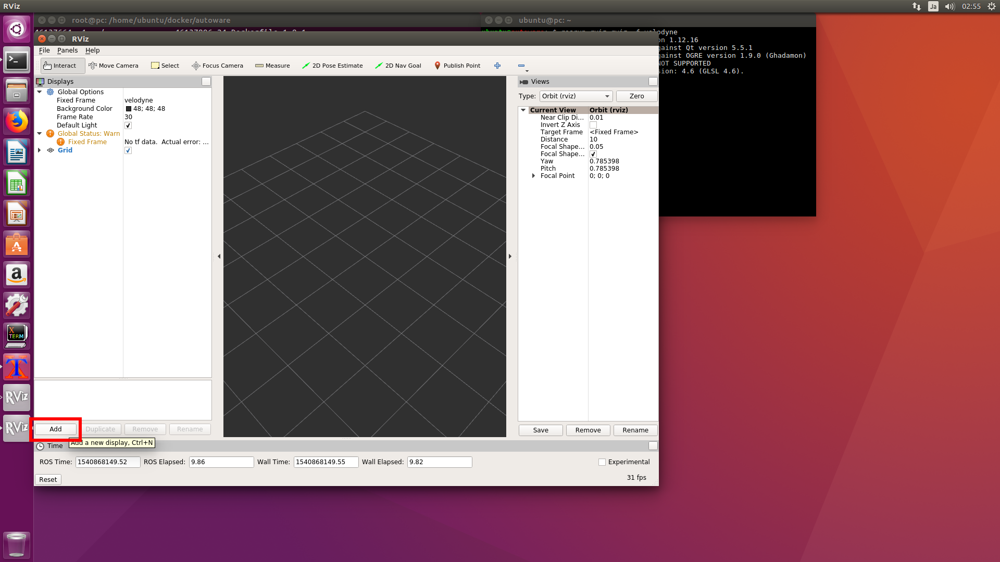
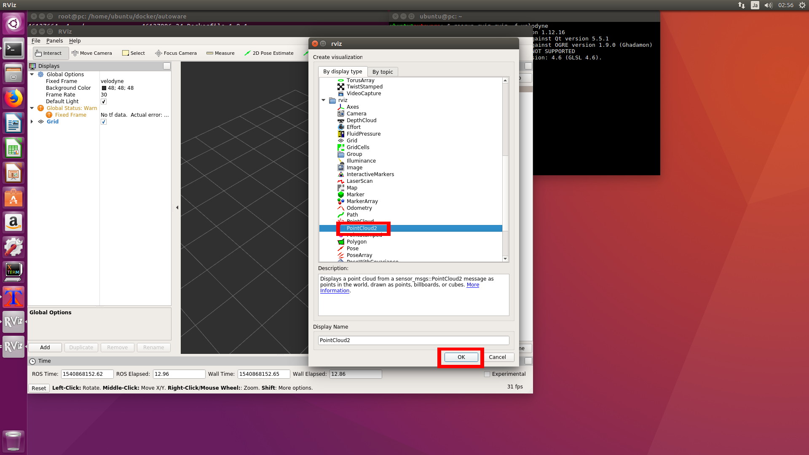
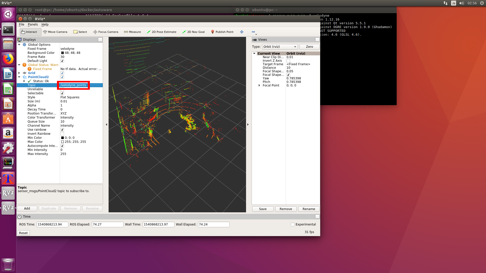
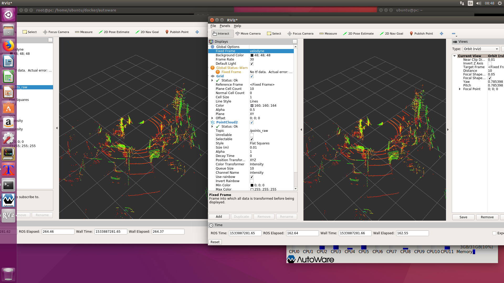

# VLP-16のデータをROS RVizで確認
<hr>

## 【Autowareコンテナを起動】
AutowareコンテナにはROS一式をインストールしてあるので、ROSをそのまま使うことができます。<br>
```
docker start CONTAINER_ID
```
`setfacl.sh`を実行してハードウェアパーミッションの変更を行います。<br>
```
sudo su
/home/ubuntu/scripts/setfacl.sh
exit
```

## 【VLP-16のデータをROS RVizで確認】
### roscoreを起動
```
roscore&
```
### VLP-16のROSノードを起動
```
roslaunch velodyne_pointcloud VLP16_points.launch &
```

### コマンドラインでの確認
```
rosnode list
rostopic list
rostopic echo /velodyne_points
```

### RVizでの確認
```
rosrun rviz rviz -f velodyne
```
rviz画面左下の方にあるAddボタンを押して、PointCloud2の項目を追加します。<br>



PointCloud2項目のTopic項目に/velodyne_pointsを入力してrviz画面にVLP-16の値を表示します。<br>


左：rosrun、右：AutowareのRViz<br>

Autowareではトピック名の変換が行われていますが、rawデータは同じものとなります。<br>

<hr>
