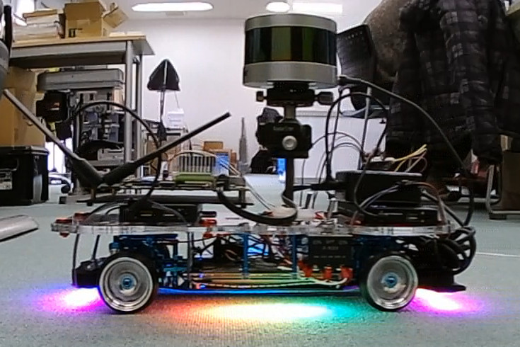

# LiDARの値をROSBAGに保存
<hr>

## 【目標】
Velodyne VLP-16を使って空間マップを作成する

## 【必要なもの】
* Velodyne VLP-16<br>
* 空間マップ記録用のラジコン<br>
* 3D MAP作成用のPC<br>
<hr>

## 【画像】

<hr>

## 【空間マップ記録】
VLP-16の値をROSBAGに保存します。<br>
ラジコンの初期位置がマップの原点となるため、自己位置推定の開始位置も基本的に同じ位置になります。そのため、空間マップの記録開始位置が走行開始位置になるようにラジコンを置いてください。<br>
マップ作成や自己位置推定は急激なポイントの変化に弱いです。そのため、曲がる時や急に視界が広がる所はゆっくり走行してください。<br>
RVizでの確認は「VLP-16のデータをROS RVizで確認」の項目を参照してください。<br>
### roscoreを起動
```
roscore&
```
### VLP-16のROSノードを起動
```
roslaunch velodyne_pointcloud VLP16_points.launch
```
### ROSBAGに保存
```
cd AutowareData/
rosrun /rosbag record -O vlp-16.bag /velodyne_points
```

AutowareでもROSBAGに保存できますが、保存するまでの手順が多く複雑になります。<br>
また、3Dマップ作成機能ではloop closureが未実装のため、中規模以上の3Dマップ作成では位置ずれが発生します。<br>
そのため、Autowareを使わずに3Dマップを作成します。<br>

<hr>
