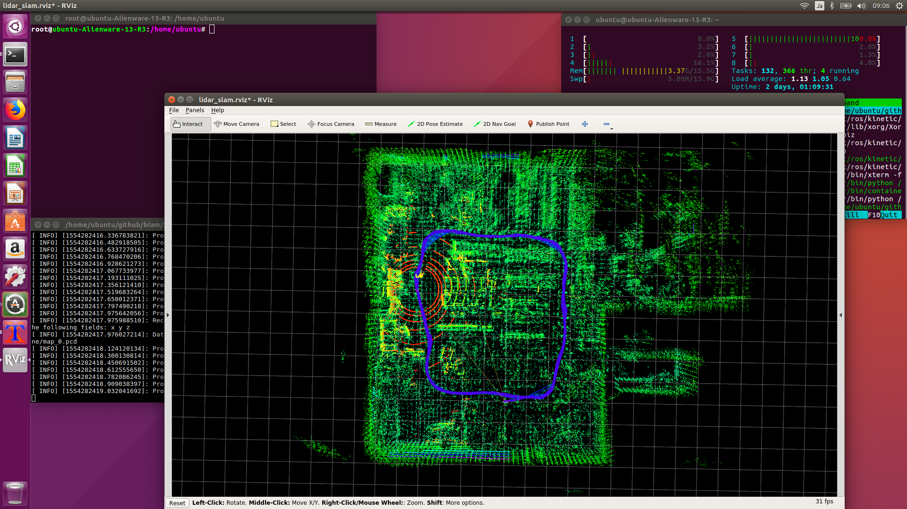

# 3Dマップを作成する
<hr>

## 【画像】

<hr>

## 【BLAMをインストール】
3Dマップ作成用のPCにBLAMをインストールします。<br>
BLAMのインストール方法はgithubに従ってください。<br>
[https://github.com/naisy/blam](https://github.com/naisy/blam)

簡単に説明すると、<br>
* apt-get install libtbb-dev libboost-all-dev cmake cpio python-wstool<br>
* ROS Kinetic<br>
* Intel MKL<br>
* GTSAM<br>

を先にインストールしてから、blamの<br>
```
./build.sh
```
を実行します。<br>
BLAMのビルド中に何度かエラーが表示されますが、そのまま処理が継続するので完了するまで待ちます。<br>

このBLAMのフォークはオフライン処理に特化しています。また、Autowareをラジコンで使うマップに最適化してあります。<br>

<hr>

## 【3Dマップを作成】
BLAMを使って3Dマップを作成します。<br>
BLAMの実行方法はgithubに従ってください。<br>

簡単に説明すると、<br>
* TX2に保存したROSBAGファイル(vlp-16.bag)をscpでPCに転送<br>

を行ってから、blamの<br>
```
./blam_offline.sh vlp-16.bag
```
を実行します。<br>

実行中は、blamの<br>
```
./blam_rviz.sh
```
を実行すると、rvizで3Dマップの作成状況を確認できます。

完成した3Dマップは`./pcd_offline/map_0.pcd`になります。<br>

<hr>
