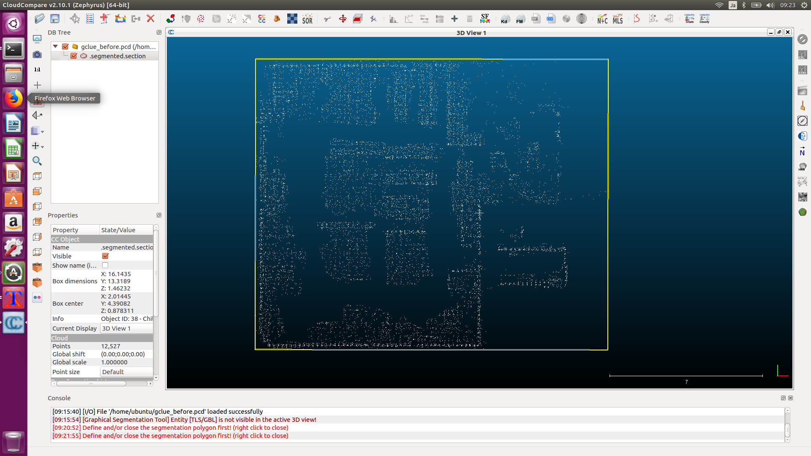

# 3Dマップを編集する
<hr>

## 【画像】

<hr>

## 【CloudCompareをインストール】
3Dマップ作成用のPCにCloudCompareをインストールします。<br>
[http://www.danielgm.net/cc/](http://www.danielgm.net/cc/)<br>
Autowareが対応しているPCDファイルを扱うために、edgeブランチを利用します。<br>
```
sudo apt-get install snap
sudo snap install cloudcompare
sudo snap refresh cloudcompare --edge
```

<hr>

## 【3Dマップを編集】
CloudCompareを起動して編集します。<br>
```
/snap/bin/cloudcompare.CloudCompare
```
床、天井、人を削除します。<br>
床と天井はどこでも同じ感じなので、自己位置推定の計算に一致して欲しくないために削除します。<br>
マップの見た目のために人も削除します。<br>
実車用のマップの場合は、2m以下はマッチさせない、という処理でこの辺をスキップしているようです。<br>

<hr>
