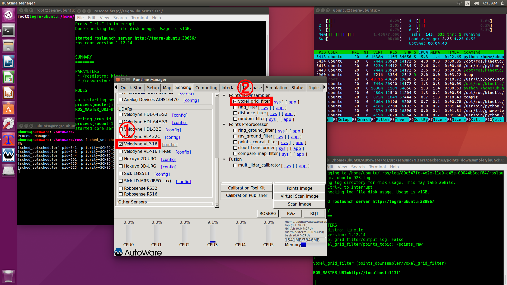

# 走行データをROSBAGに保存
<hr>

## 【目標】
Autowareを使って走行経路を作成する

## 【必要なもの】
* Velodyne VLP-16<br>
* 空間マップ記録用のラジコン<br>
<hr>

## 【画像】

<hr>

## 【走行データの記録】
マップ作成の時のようにラジコンを走行させて、走行データを保存します。<br>
マップ作成や自己位置推定は急激なポイントの変化に弱いです。そのため、曲がる時や急に視界が広がる所はゆっくり走行してください。<br>

今回の記録はAutowareで行います。<br>
走行データの記録開始位置を空間マップの記録開始位置と一致するようにラジコンを置いてください。<br>

## 【Autowareを起動】
```
cd Autoware/ros
./run&
```
## 【Autowareの設定】
Runtime Managerの[Setup][Sensing]タブの設定を行います。<br>
[Setup]タブでは[TF]のZ座標の値にVLP-16の設置高(m)を入力します。<br>
[TF]を有効にします。<br>
<br>

[Sensing]タブでは左側の[Velodyne VLP-16]と右側の[voxel_grid_filter]を有効にします。<br>
<br>

## 【ROSBAGに保存】
Runtime Managerの右下の方にある[ROSBAG]ボタンを押してウィンドウを起動します。<br>
[Refresh]ボタンを押して`/points_raw`を表示して、チェックします。<br>
[Ref]ボタンを押して保存先を選択します。デフォルトのままだと保存されないバグがあります。<br>
[Start]ボタンを押してROSBAGの保存を開始します。<br>
モニタ、キーボード、マウスを外して室内を一周走行します。<br>
戻ったらモニタ、キーボード、マウスを装着して[Stop]ボタンを押して終了します。<br>
<br>

## 【Autowareを終了】
一旦ROSのノード情報をクリアするためにAutowareを終了します。

<hr>

