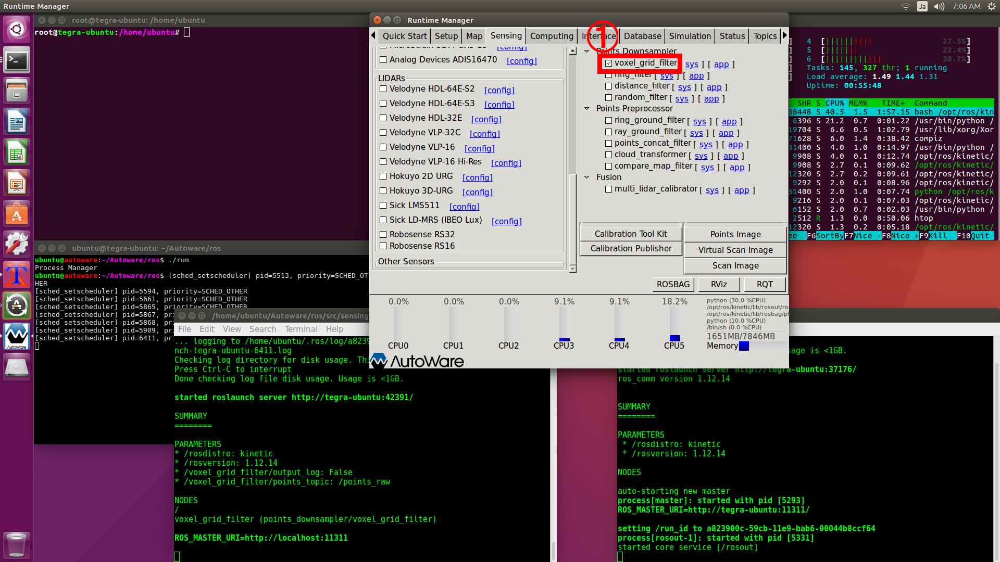

# 走行経路を作成する
<hr>

## 【画像】

<hr>

## 【Autowareを起動】
ROSのノード情報をクリアするためにAutowareは一旦終了後、再起動します。
```
cd Autoware/ros
./run&
```

## 【Autowareの設定】
Runtime Managerの[Simulation][Setup][Map][Sensing][Computing]タブの設定を行います。<br>
ROSの時間軸をシミュレーション時間にするために、Autoware起動後は最初に[Simulation]タブの設定を行います。<br>
[Simulation]タブで経路走行時のrosbagファイルを読み込みます。<br>
一度[Play]ボタンを押した後、[Pause]ボタンを押します。ここはROSの時間軸をシミュレーション時間にするための方法なので、すぐに[Pause]を押して大丈夫です。<br>
<br>
[Setup]タブでは[TF]と[Vehicle Model]を有効にします。<br>
<br>

[Map]タブでは[Point Cloud]ボタンと[TF]ボタンを有効にします。<br>
[Point Cloud]はCloudCompareで編集したPCDファイルを指定します。<br>
[TF]はAutowareに用意されている原点座標のファイルを指定します。<br>
<br>

[Sensing]タブでは[voxel_grid_filter]を有効にします。<br>
VLP-16の値はシミュレーションの再生から得るため、実際のセンサとなる[Velodyne VLP-16]は無効にしておきます。<br>
<br>

[Computing]タブでは[ndt_matching][vel_pose_connect][waypoint_saver]を有効にします。<br>
[waypoint_saver]の[app]で出力に指定するファイルは新規ファイルになるようにしてください。<br>
既存のファイルを指定すると追記されるため、読み込み時にCSVヘッダーが重複してフォーマットエラーとなります。<br>
<br>
<br>

## 【RVizの設定】
[RViz]ボタンを押してRVizを起動します。<br>
Autowareに用意されている`Autoware/ros/src/.config/rviz/default.rviz`ファイルを読み込みます。<br>
<br>
隠しディレクトリを表示するため、右クリックメニューで[Show hidden files]を有効にします。<br>
<br>
<br>
シミュレーションを一次停止しているので画面には何も表示されませんが、これは正常です。<br>
<br>
[Simulation]タブの[Pause]ボタンを時間を進めることで、RVizにマップが表示されます。<br>
<br>
ここで自己位置推定に失敗している場合は、一度[Simulation]タブの[Pause]を押して[Computing]タブの[ndt_matching]を無効にしてから再度有効にしてください。<br>
<br>
<br>

RViz画面に[waypoint_saver_maker]を追加して、waypointの作成を表示します。<br>
<br>

## 【走行経路を作成】
シミュレーションを進めてwaypointを作成します。<br>
<br>
<br>

途中で自己位置推定に失敗する場合は、ラジコンの速度を落として走行データを作成しなおしてください。<br>


## 【Autowareを終了】
一旦ROSのノード情報をクリアするためにAutowareを終了します。

<hr>

