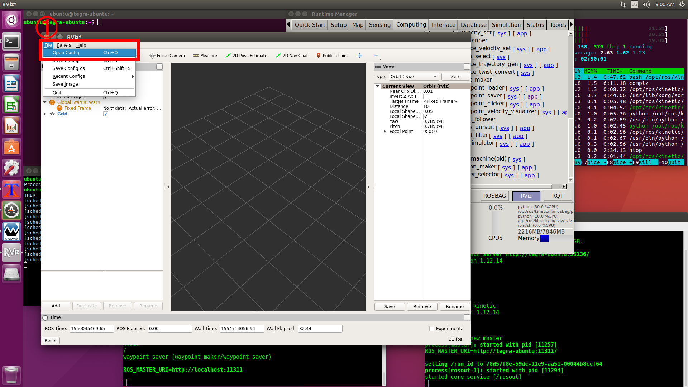

# Autowareの走行設定
<hr>

## 【目標】
Autowareを使って自動走行する

## 【必要なもの】
* Velodyne VLP-16<br>
* 空間マップ記録用のラジコン<br>
<hr>

## 【画像】

<hr>

## 【Autowareを起動】
```
cd Autoware/ros
./run&
```

## 【Autowareの設定】
Runtime Managerの[Setup][Map][Sensing][Computing]タブの設定を行います。<br>

### [Setup]タブ
[Setup]タブでは[TF]と[Vehicle Model]を有効にします。<br>
<br>

### [Map]タブ
[Map]タブでは[Point Cloud]ボタンと[TF]ボタンを有効にします。<br>
[Point Cloud]はCloudCompareで編集したPCDファイルを指定します。<br>
[TF]はAutowareに用意されている原点座標のファイル`Autoware/ros/src/.config/tf/tf_local.launch`を指定します。<br>
<br>

### [Sensing]タブ
[Sensing]タブでは左側の[Velodyne VLP-16]と右側の[voxel_grid_filter]を有効にします。<br>
<br>

### [Computing]タブ
[Computing]タブでは[ndt_matching][vel_pose_connect][waypoint_lodar][lattice_velocity_set][path_select][pure_pursuit][twist_filter][lane_rule][lane_select]を有効にします。<br>
[waypoint_loader]の[app]で入力に指定するファイルはマップに対応した経路ファイルを指定してください。<br>
<br>
<br>

## 【RVizの設定】
[RViz]ボタンを押してRVizを起動します。<br>
Autowareに用意されている`Autoware/ros/src/.config/rviz/default.rviz`ファイルを読み込みます。<br>
隠しディレクトリを表示するため、右クリックメニューで[Show hidden files]を有効にします。<br>
<br>
<br>
<br>
ここで自己位置推定に失敗している場合は、[Computing]タブの[ndt_matching]を無効にしてから再度有効にしてください。<br>
<br>
<br>
<br>
経路が表示されてない場合は、ラジコンを少し移動して経路を表示します。<br>
<br>

## 【Topicの確認】
[Computing]タブの[pure_pursuit][twist_filter]を有効にすると、Autowareの車両制御命令が配信されます。<br>
その値を確認してみます。<br>
### 目標速度と角速度
[Topic]タブの左側で[twist_cmd]をクリックします。<br>
[Topic]タブの右側の[Echo]を有効にします。<br>
`linear:x`の値は目標速度(m/s)になります。<br>
`angular:z`の値は目標角速度(rad)になります。<br>
ラジコン車両を制御する場合は、この値からモーターとサーボのPWM値に変換します。<br>
しかし、それだけでは急発進したり、実際の速度が不一致になるため、現在の速度も考慮して車両制御コードを作成した方がよいです。<br>
<br>

### 現在速度
[Topic]タブの左下にある[Reflesh]ボタンをクリックします。<br>
[Topic]タブの左側で[current_velocity]をクリックします。<br>
[Topic]タブの右側の[Echo]を有効にします。<br>
`linear:x`の値は現在速度(m/s)になります。<br>
`angular:z`の値は現在角速度(rad)になります。この値は使いません。<br>
自己位置推定の誤差により、停止状態でもこの値は変化があります。<br>
ラジコン車両制御では、現在速度と目標速度の大小比較からモーターの出力を上下します。<br>
また、現在速度が停止時の誤差を考慮した一定値以下であれば、モーターの最大出力を制限することで、急発進を抑制することが出来ます。<br>
<br>

## 【RVizを終了】
TX2はAutowareの動作に必要となる処理性能が十分とは言えないため、走行前にRVizを終了しておきます。<br>
RVizを起動したまま自動走行すると、自己位置推定に失敗してクラッシュしやすくなります。<br>

<hr>
