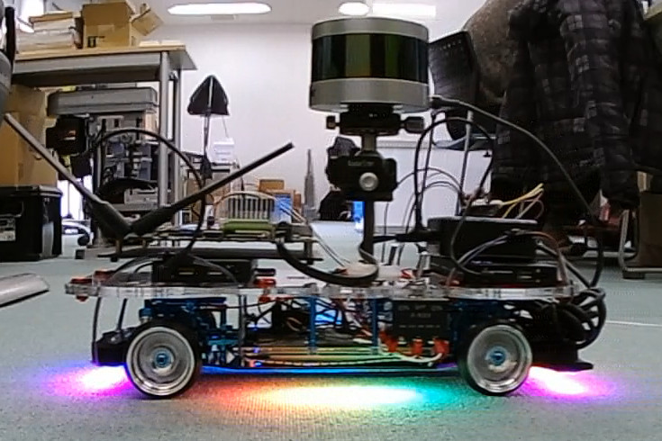

# ラジコンをROSで制御する
<hr>

## 【必要なもの】
* Velodyne VLP-16<br>
* 空間マップ記録用のラジコン<br>
<hr>

## 【画像】

<hr>

## 【ラジコン制御コードを実行】
Autowareの走行設定が終わり、車両制御トピックで速度と角速度が流れていることを確認してから、ラジコン制御コードを実行します。<br>
i2c/smbusを利用するため、TX2のターミナル上でroot権限で実行します。<br>
```
sudo su
cd roscar
python run_autoware_car.py
```

## 【ラジコンのスイッチをオン】
自動走行プログラムを実行したら、モニタ、キーボード、マウスを外します。<br>
ラジコンのサーボとモーターのスイッチをプログラム側に入れます。<br>
ラジコンの自動走行が開始します。<br>


ラジコンをプロポで操作する場合は、ラジコンのスイッチをトランスミッター側に入れます。<br>


## 【ラジコンのスイッチをオフ】
自動走行を終了する時は、ラジコンのスイッチをオフにします。<br>
スイッチの真ん中の位置がオフになります。<br>
ラジコンの自動走行が終了します。<br>

<hr>
