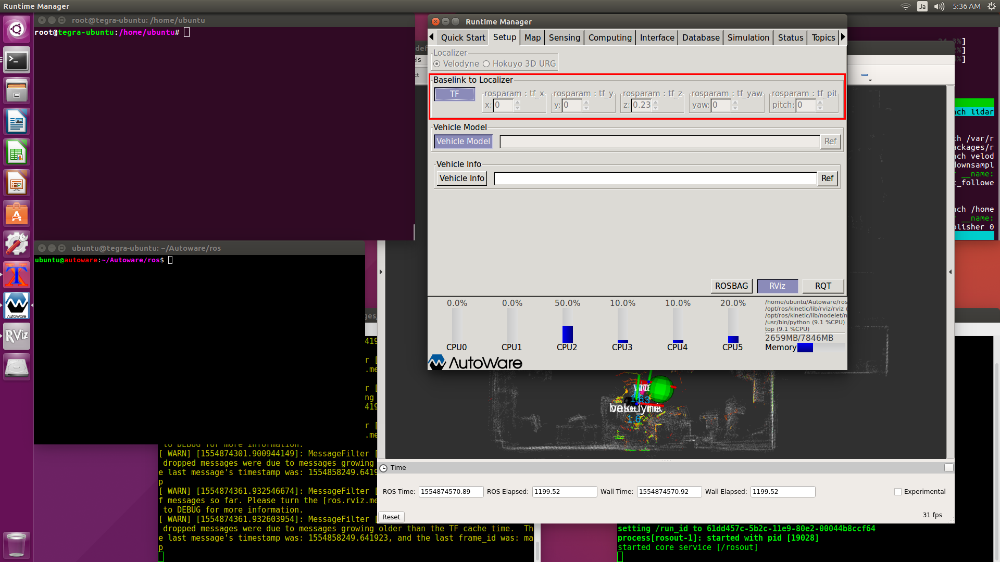

# [Setup]タブ

## 【TF】
VLP-16はラジコンの中央に設置しているので、x,y座標を0(m)とします 
地上からの高さ23cmの位置に設置しているので、z座標を0.23(m)とします。 

基本的に一番最初に設定します。 

例外として、ROSBAGを再生するために[Simulation]を使う場合は、Simulationを再生してから[TF]を有効にします。 
間違えて[TF]を先に有効にしてからROSBAG（過去の時間を持つ）を再生すると、時間軸が現在の時間に設定されてしまうため、ROSBAGファイル内に現在時間のデータが無いために再生できない問題が発生します。 

## 【Vehicle Model】
デフォルトでは`~/Autoware/ros/src/.config/model/default.urdf`が読み込まれます。 

無効のままでも動作に問題はありません。 

