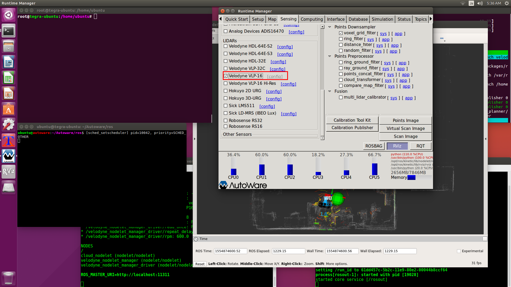
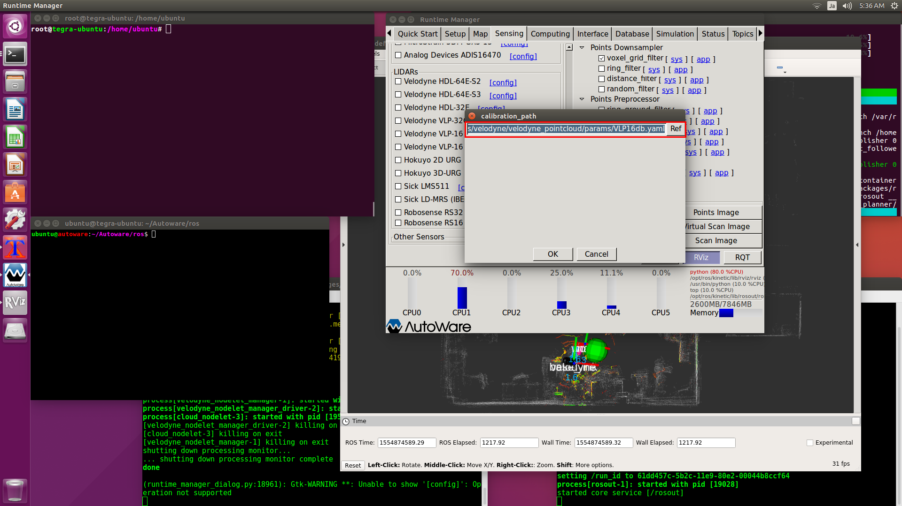
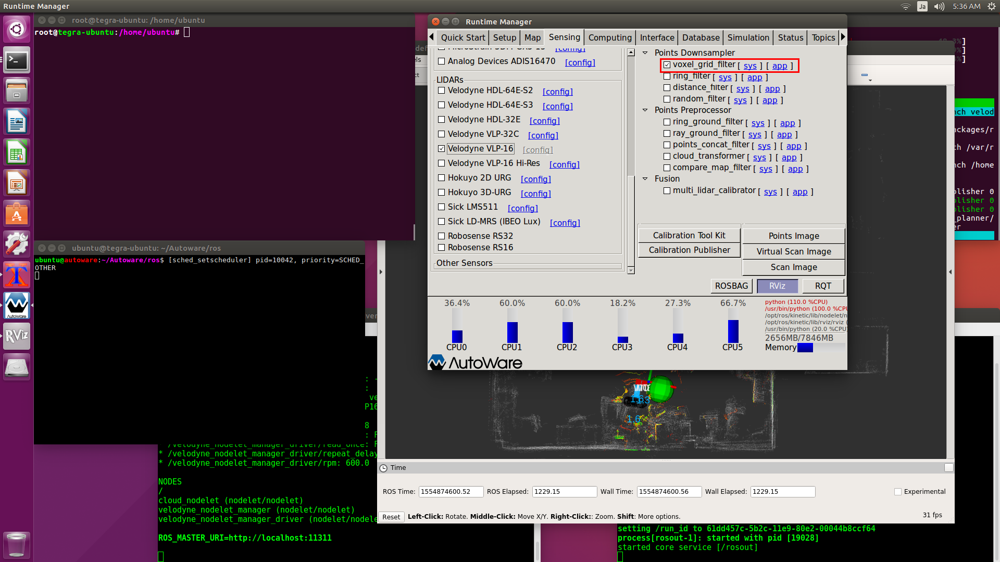
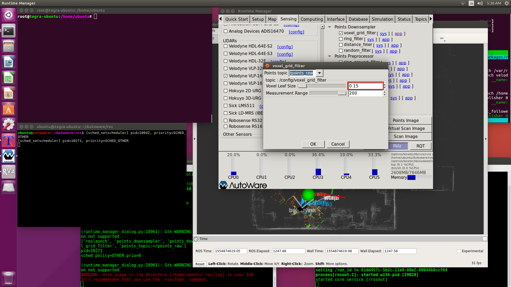

# [Sensing]タブ

## 【Velodyne VLP-16】
[config]でVLP-16のキャリブレーションファイルを指定して、VLP-16を有効にします。 
`~/Autoware/ros/src/sensing/drivers/lidar/packages/velodyne/velodyne_pointcloud/params/VLP16db.yaml`

`VLP16_hires_db.yaml`はVLP-16のハイレゾリューション版用のキャリブレーションで、これはセンサー自体が別物になります。 

## 【voxel_grid_filter】
VLP-16は毎秒30万箇所の距離を計測します。 
このポイント数を削減して処理速度を向上させます。 
[voxel_grid_filter]の[app]をクリックして、[Voxel Leaf Size]を0.15(m)に変更します。 
この値は小さいほど精度があがりますが、屋外のような広い空間では調整が必要になるかもしれません。 

