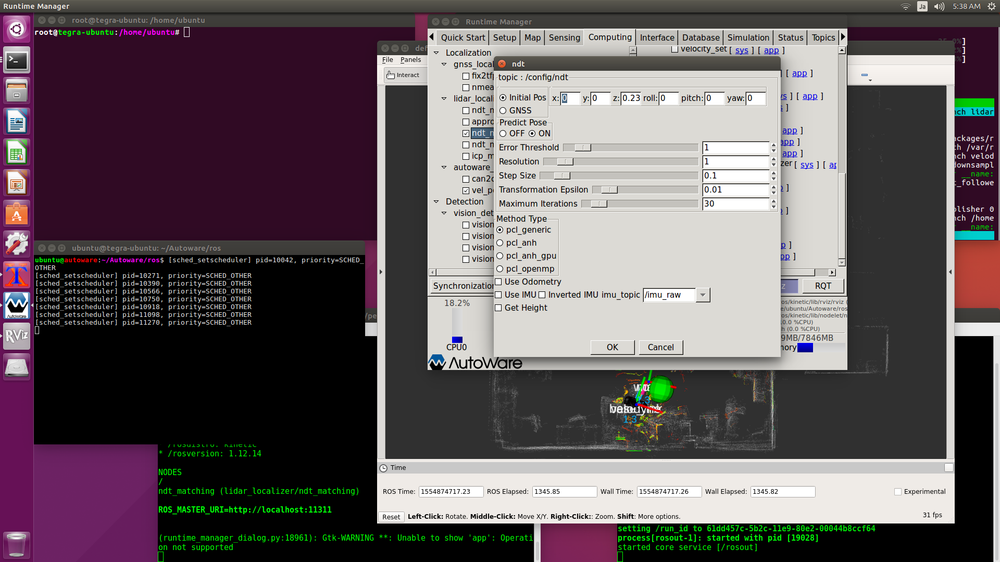
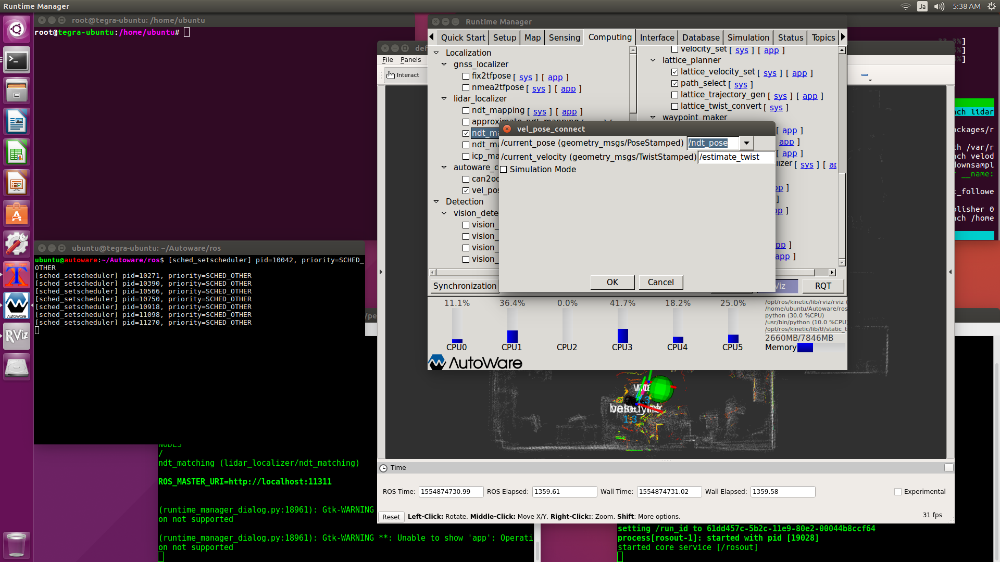
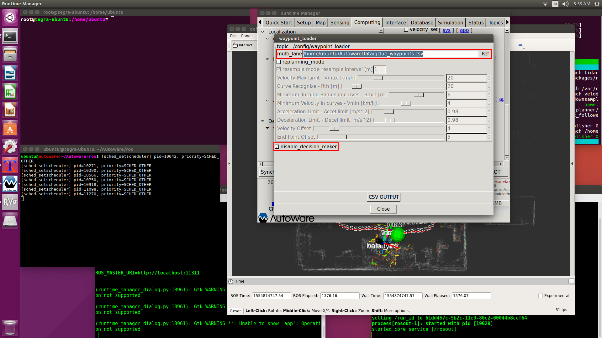
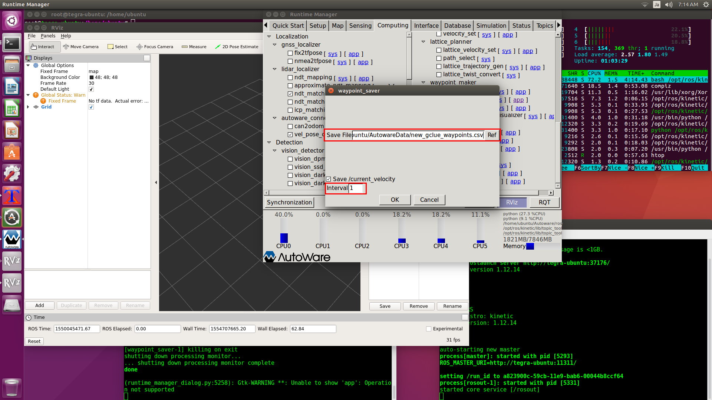
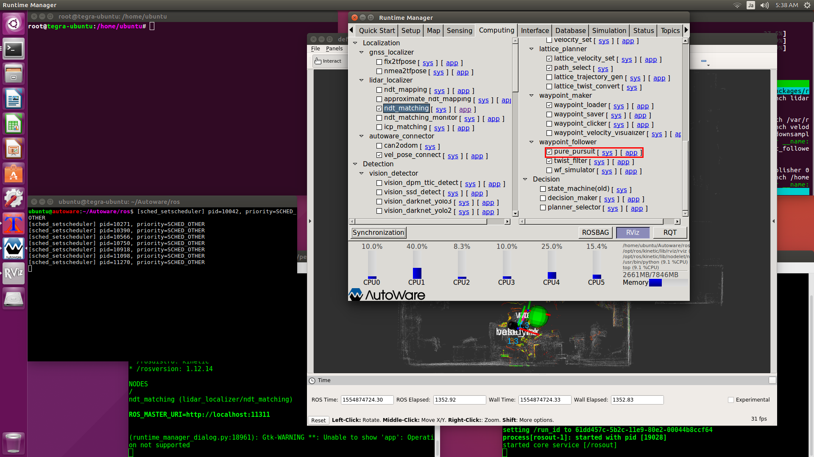
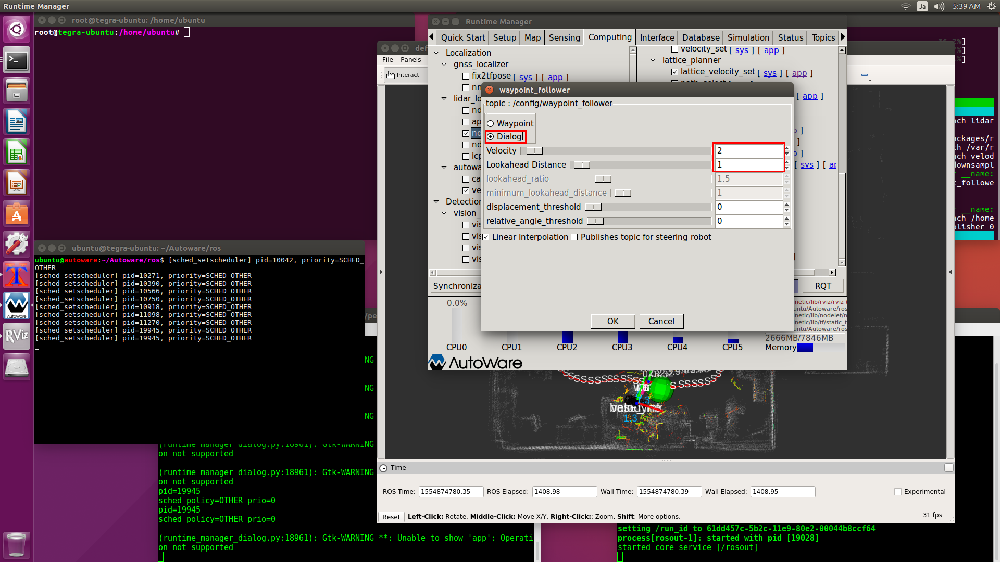
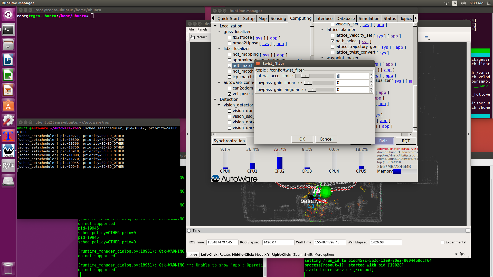
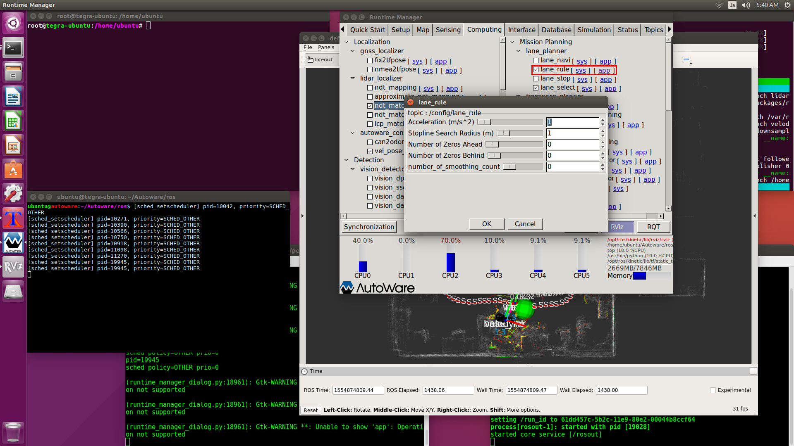
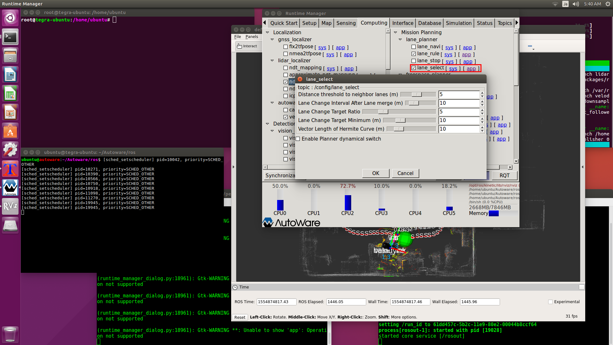
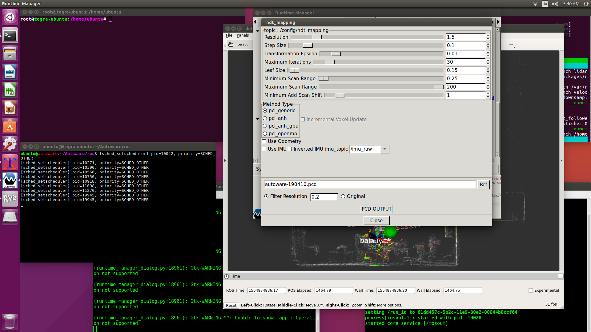

# [Computing]タブ
<hr>

## 【ndt_matching】
自己位置推定を有効にする機能です。<br>
[ndt_matching]の[app]をクリックして、パラメータを画像のように変更してから[ndt_matching]を有効にします。<br>
<br>
<br>

走行中に自己位置推定に失敗する時は、[Resolution]の値を0.25くらい上下に変更して、より良い値を探してください。<br>

## 【vel_pose_connect】
waypointを保存したり読み込んだりする時に有効にする機能です。<br>
この[app]パラメータは変更する必要はありません。<br>
<br>
<br>

## 【waypoint_loader】
waypointを読み込む機能です。<br>
自動走行するときに有効にします。<br>
<br>
<br>

## 【waypoint_saver】
waypointを作成する機能です。<br>
走行経路を作成するときに有効にします。<br>
[app]では保存先のファイル名（新規ファイル）を指定します。<br>
既存のファイルを指定すると追記となるため、csvファイルの編集が必要になります。<br>
狭い通路を正確に通る必要がある場合は、[interval]の値を小さくするといいようです。<br>
<br>
<br>

作成されるcsvファイルは以下のフォーマットになります。<br>
自動走行時に壁や机にぶつかるときは、この値を手作業で修正します。<br>
```
x,y,z,yaw,velocity,change_flag
0.0628,-0.2692,-0.1305,0.1764,0,0
0.2852,-0.1747,-0.1489,0.2329,2.2013,0
0.5322,-0.1714,-0.1321,0.2984,3.3149,0
```
速度も保存していますが、この速度は利用しません。<br>
そのため、経路作成用の走行は、自己位置推定に失敗しないような速度であれば速くても遅くても構いません。<br>

## 【lattice_velocity_set】
自動走行するときに有効にします。<br>
[app]では障害物検出範囲を設定しますが、室内マップだと空間が狭すぎるようなので、[Detection Range]と[Deceleration Range]は小さい値にしておきます。<br>
<br>
<br>

## 【path_select】
自動走行するときに有効にします。<br>
<br>

## 【pure_pursuit】
車両制御命令となる、目標速度と目標角速度をROSトピックで配信するときに有効にします。<br>
[app]では[Dialog]を選択します。これは[Waypoint]よりも安定した走行になるようです。<br>
[Velocity]はターゲットボールの移動速度として2(km/h)を設定します。<br>
[Lookahead Distance]はターゲットボールまでの距離として1(m)を設定します。<br>
ラジコンではこの比率(2km/h:1m、4km/h:2m、6km/h:3m)がいいようです。<br>
<br>
<br>

## 【twist_filter】
車両制御命令となる、目標速度と目標角速度をROSトピックで配信するときに有効にします。<br>
[app]では[lateral_accel_limit]を1にしておきますが、この値が適切かはわかりません。<br>
<br>
<br>

## 【lane_rule】
自動走行するときに有効にします。<br>
[app]では全ての値を最小にしていますが、経路を一つしか持っていないため、この値が適切かはわかりません。<br>
<br>

## 【lane_select】
自動走行するときに有効にします。<br>
[app]では全ての値を最小にしていますが、経路を一つしか持っていないため、この値が適切かはわかりません。<br>
<br>

## 【ndt_mapping】
3Dマップを作成するときに有効にします。<br>
loop closureが未実装のため、中規模のマップでは位置ずれが発生します。<br>
また、室内マップでもポイント数が多くなっていくため、処理時間が遅くなります。<br>

3Dマップの作成はBLAMを使うようにしたため、この機能は使いません。<br>

<br>
<br>

<hr>
