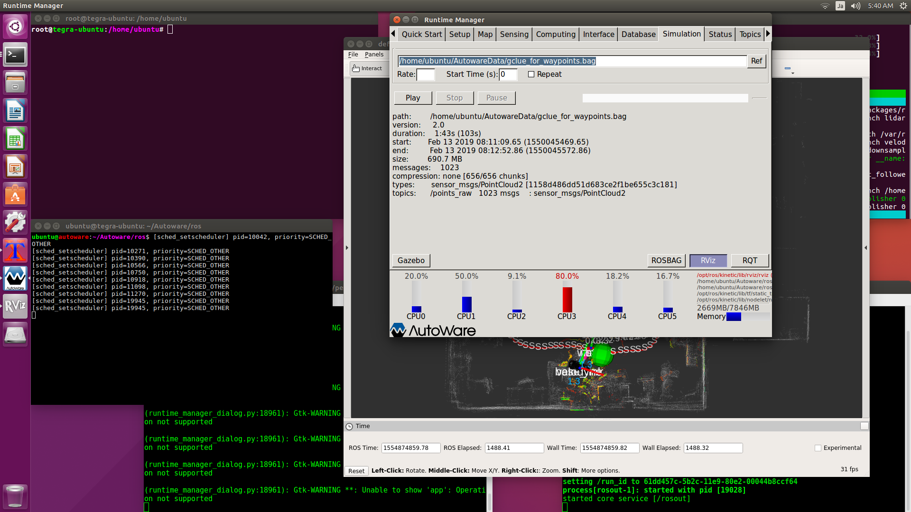

# [Simulation]タブ

## 【ROSBAG Play】
走行経路を作成するときに使います。 
走行を再現するときに使います。 
3Dマップを作成するときに使います。しかし3DマップはBLAMで作ることにしたため、この場合は使いません。 

シミュレーションを再生するときは、[Setup]タブの[TF]が無効の状態で[Play]を押してください。 
その後、[Setup]タブの[TF]を有効にしてください。 
シミュレーションを使う時に、うまくいかない場合はAutowareを再起動してください。 

 

