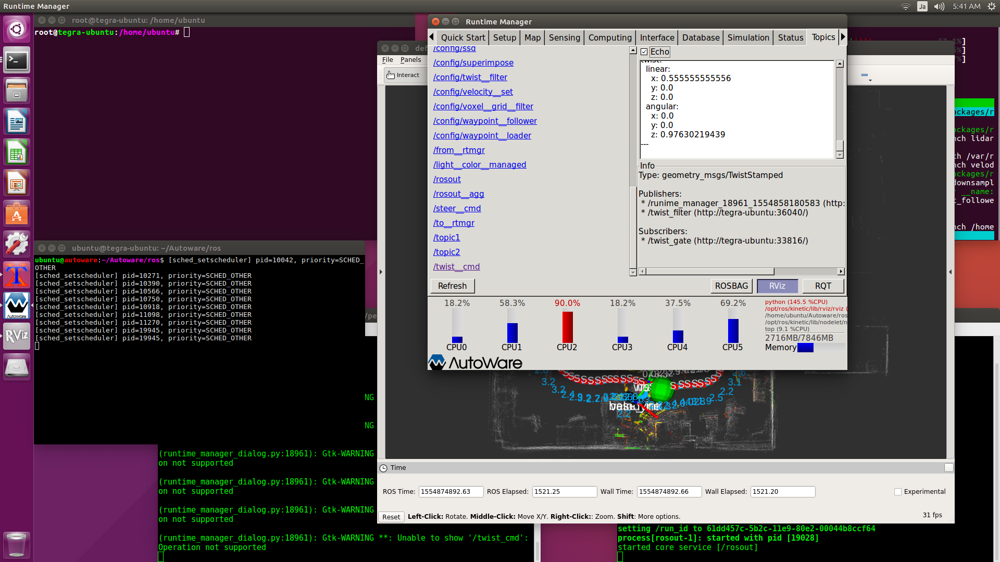
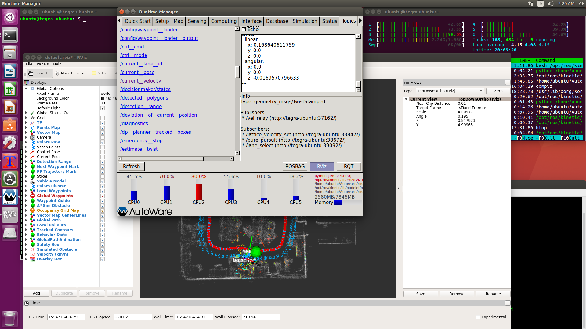

# [Topics]タブ
<hr>

## 【twist_cmd】
車両制御命令のROSトピックです。<br>
[/twist_cmd]トピックが目標値を持つトピックになります。<br>
`twist_cmd.twist.linear.x`が目標速度(m/s)です。<br>
`twist_cmd.twist.angular.z`が目標角速度(rad/s)です。<br>
[Refresh]ボタンをクリックすると、現在値を持つ[/current_velocity]トピックが表示されます。<br>
`current_velocity.twist.linear.x`が現在速度(m/s)です。<br>
`current_velocity.twist.angular.z`が現在角速度(rad/s)です。<br>
この値が取得できる状態なら、車両が走行可能になります。<br>

<br>
<br>

xtermのコマンドラインでも確認できます。<br>
```
rostopic echo /twist_cmd
```

<hr>
