# ラジコン本体

## 【画像】
 

## 【AWD】
総重量5.4kgになるため、AWDの車体を選択します。 
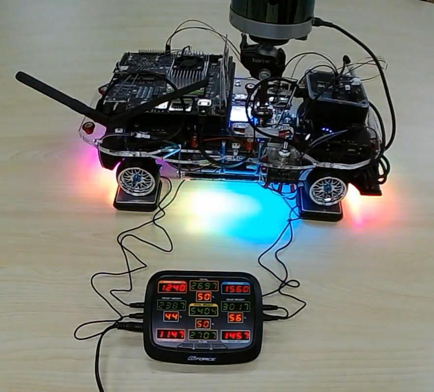 

画像のラジコンは「Eagle TT02-01D-KGA156」をベースに前後ギア比を1:1に変更する等の改造をしています。 

「タミヤ CC-01」をベース車両に選択すると、改造コストを低く出来るかもしれません。 

 
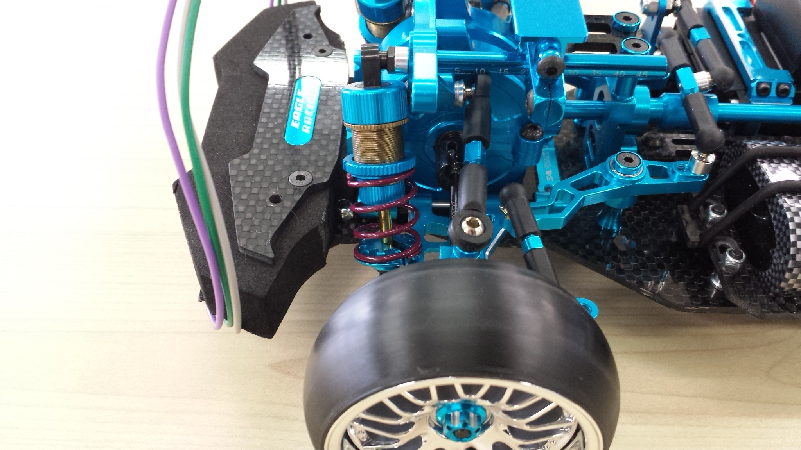 
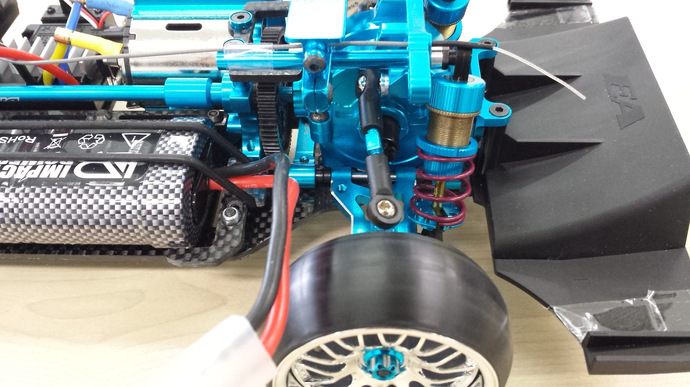 
 
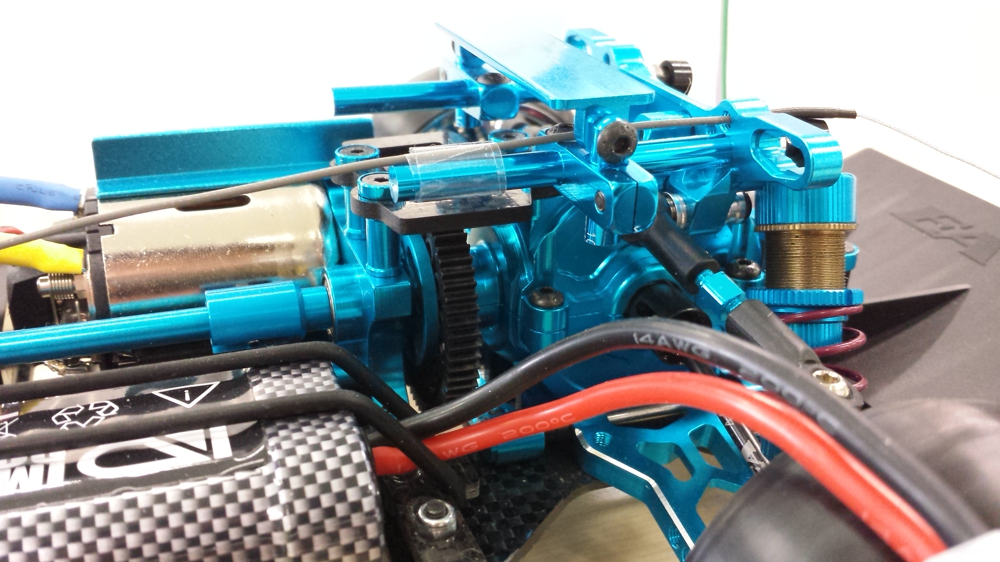 
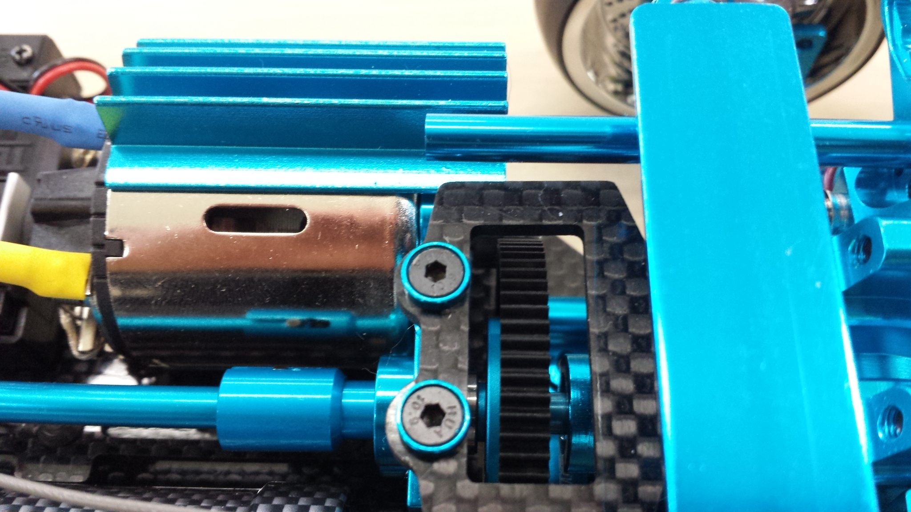 
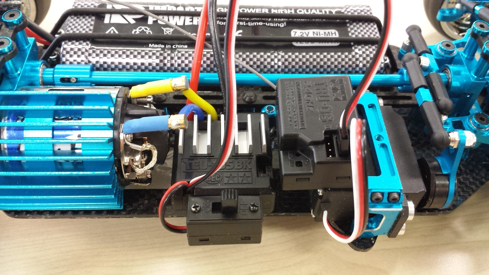 
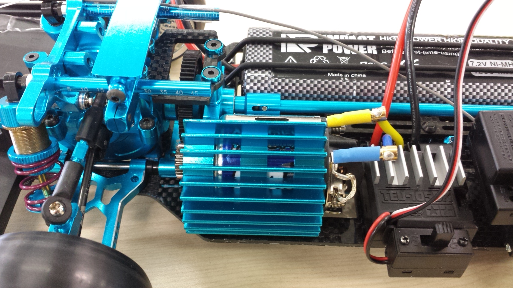 
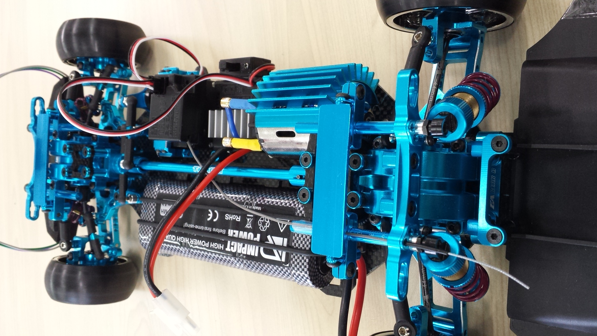 
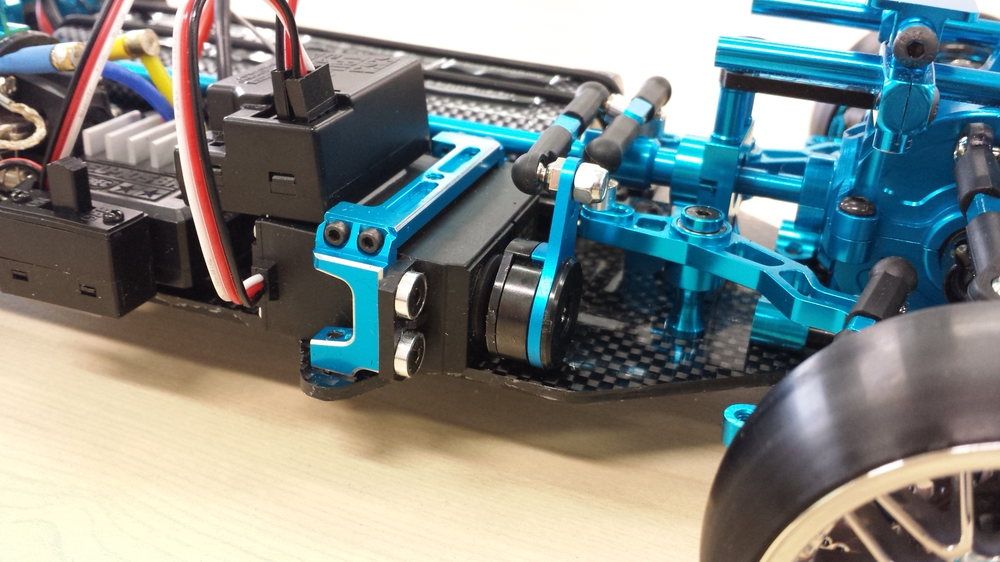 
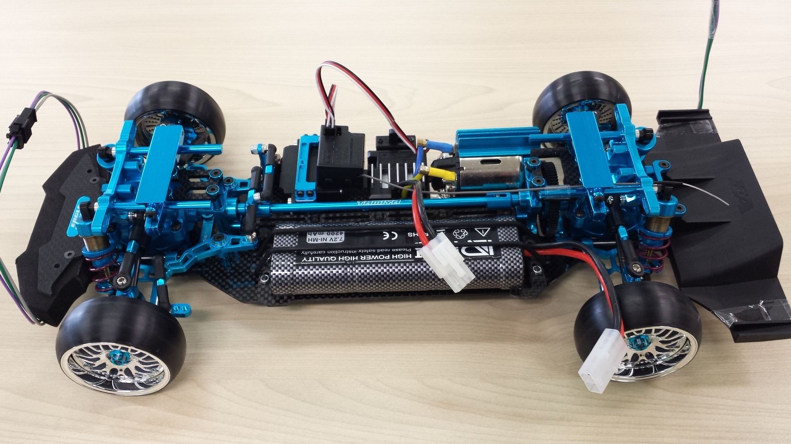 
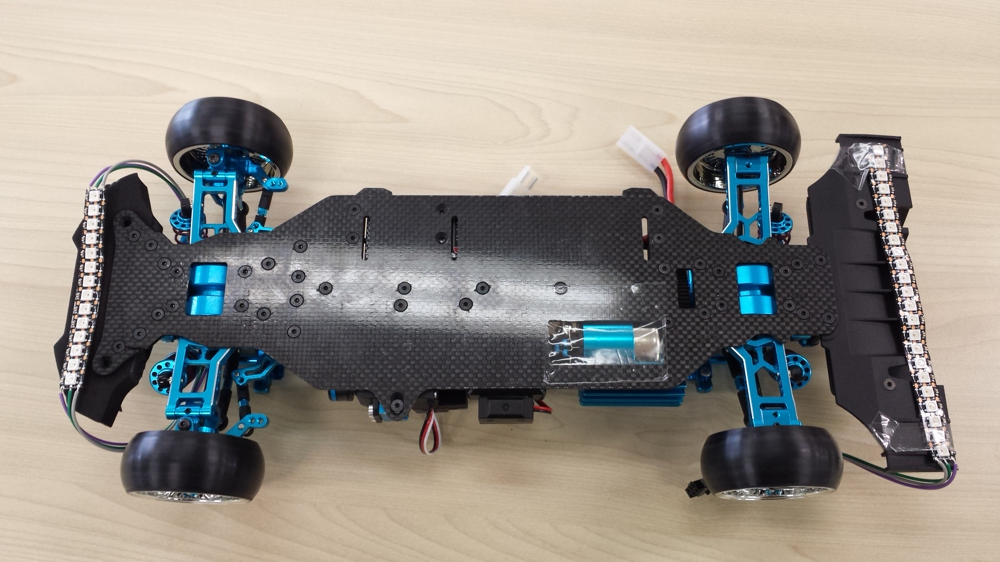 
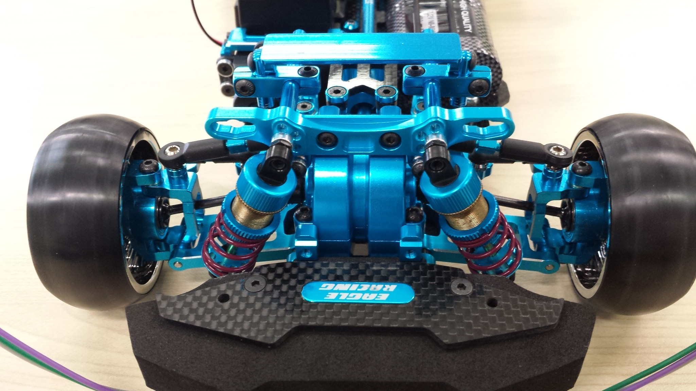 
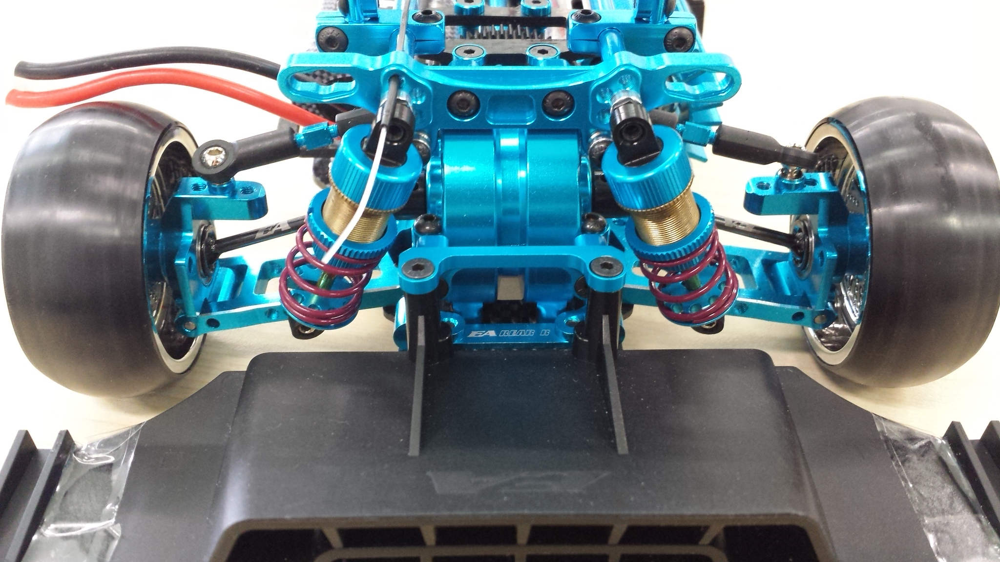 
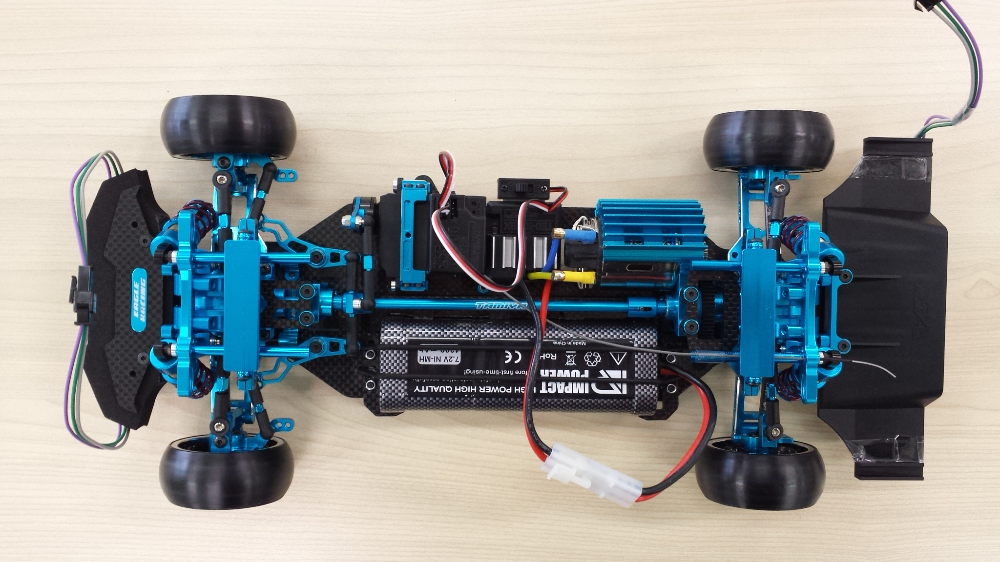 

## 【モーター】
モーターはブラシモーターのYOKOMO YM-SS58 58Tを搭載しています。 
とても重い車両になるので、トルク重視でモーターを選択します。 
もっとトルクが必要な場合は、「ATLAS ロッククライマー クローラーモーター」シリーズで40T-130Tまで選択できます。 

## 【ESC】
「タミヤ(TAMIYA) RCシステムシリーズ No.53 ファインスペック 2.4G 電動RCドライブセット 45053」のTEU-105BKを搭載しています。 

## 【サーボ】
「タミヤ(TAMIYA) RCシステムシリーズ No.53 ファインスペック 2.4G 電動RCドライブセット 45053」のTSU-03を搭載しています。 

## 【受信機】
「タミヤ(TAMIYA) RCシステムシリーズ No.53 ファインスペック 2.4G 電動RCドライブセット 45053」のTRU-08を搭載しています。 

## 【送信機】
「タミヤ(TAMIYA) RCシステムシリーズ No.53 ファインスペック 2.4G 電動RCドライブセット 45053」のTTU-08を搭載しています。 

## 【バッテリー】
4200mAh 7.2V Ni-MHバッテリーを搭載しています。 
「タミヤ(TAMIYA) RCシステムシリーズ No.53 ファインスペック 2.4G 電動RCドライブセット 45053」の1300mAh 7.2V Ni-Cdバッテリーも利用可能です。 
タミヤLF6.6Vバッテリーにも対応します。 

## 【タイヤ】
コンクリートの上を走る場合はゴムタイヤを使用します。 
ゴムタイヤの場合は、車両が重過ぎて停車状態ではサーボが動かないので、小回りは出来ないことに注意が必要です。 
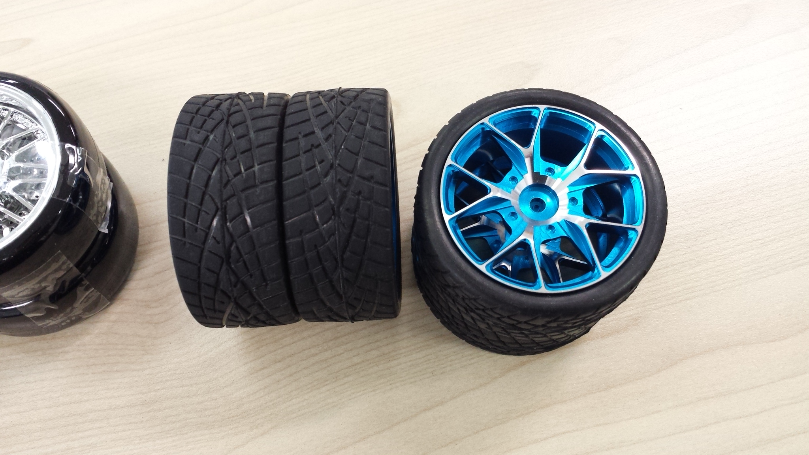 

「Eagle TT02-01D-KGA156」標準のプラスチック製タイヤ。 
プラスチック製タイヤでコンクリートの上を走るとすぐに痛みます。 
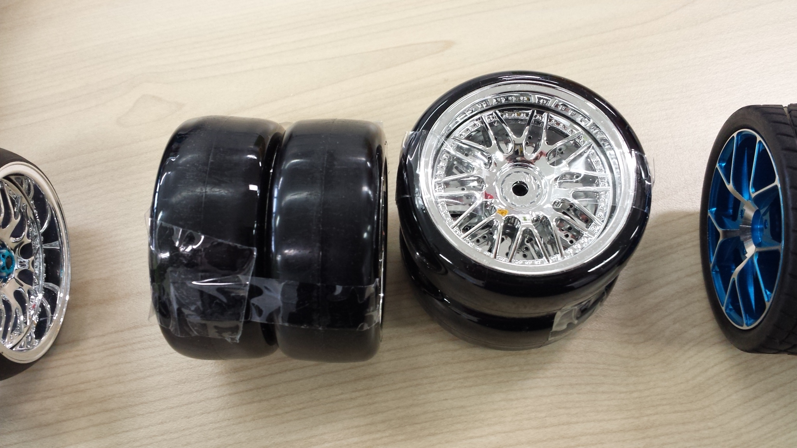 

カーペットの上を走る場合はプラスチック製のラジアスタイヤを使用します。 
通常の走行ではプラスチック製フラットタイヤと変わらないのですが、ドリフト走行のように滑らせて走る場合に非常に安定したグリップ力があります。 
「コンスタントグリップ・ドリフトタイヤ ソフト 4個入り 3946-S4」 
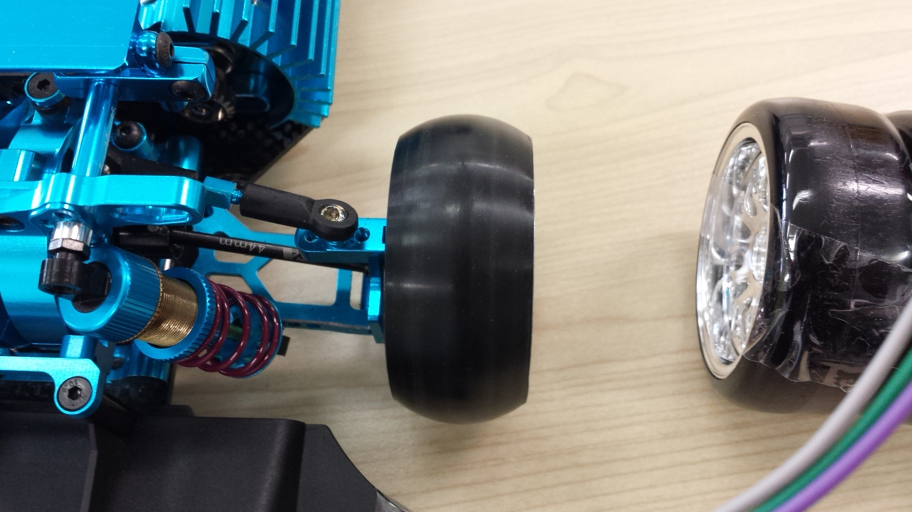 
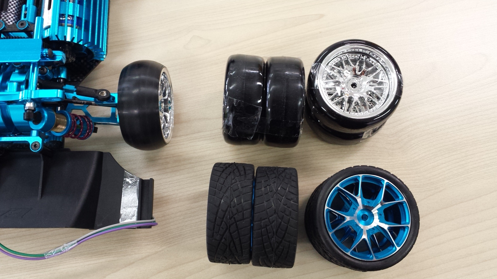 

## 【ダンパー】
前後共に、 
「タミヤ TRFシリーズ No.187 ビッグボアダンパー (4本) 42287」 
「タミヤ HOP-UP OPTIONS OP-445 シリコンダンパーオイルハード #1000」 
「タミヤ HOP-UP OPTIONS OP-636 ウルトラハードスプリング」 
を使用しています。 

 
 

