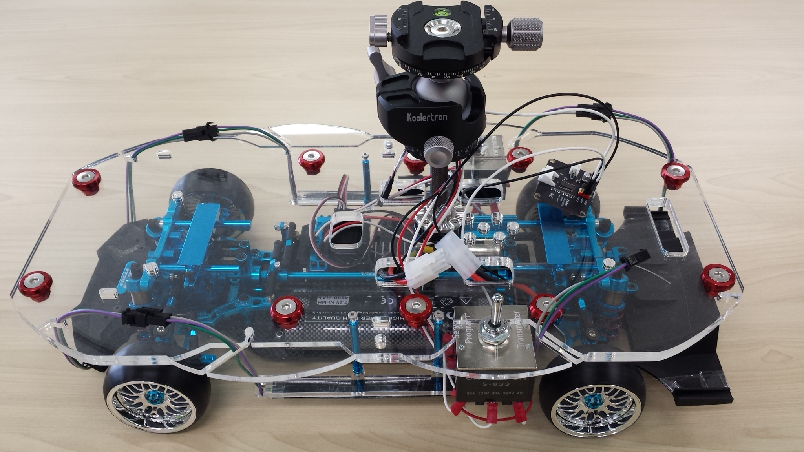
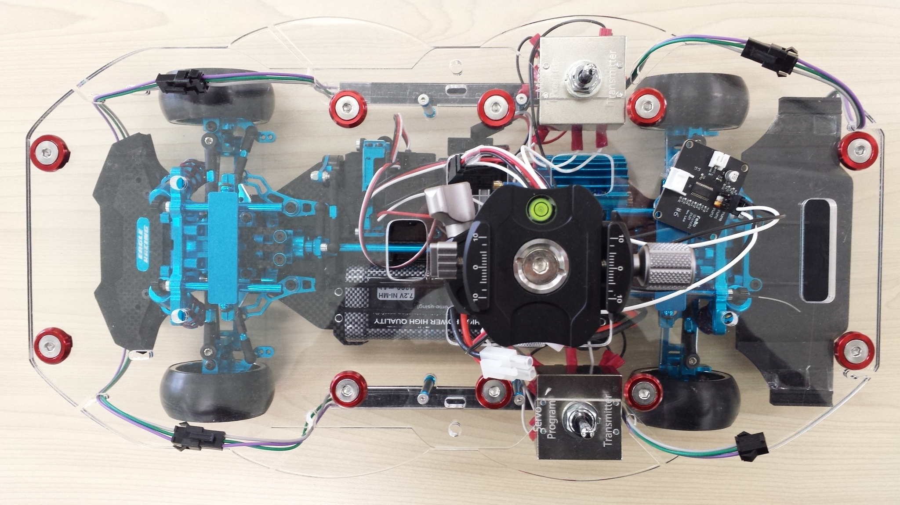
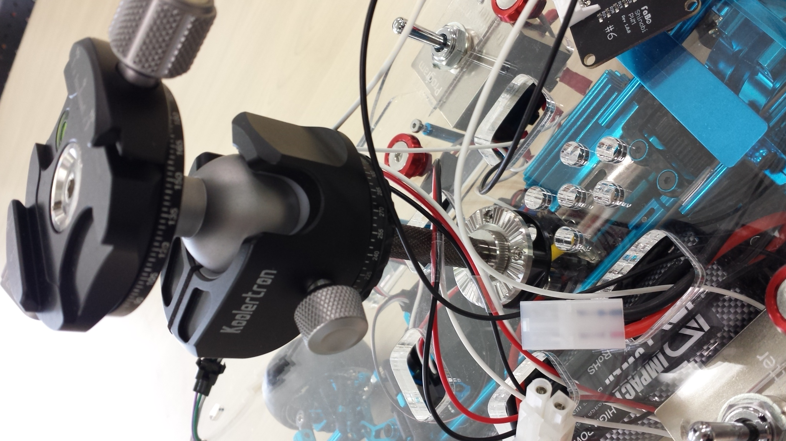
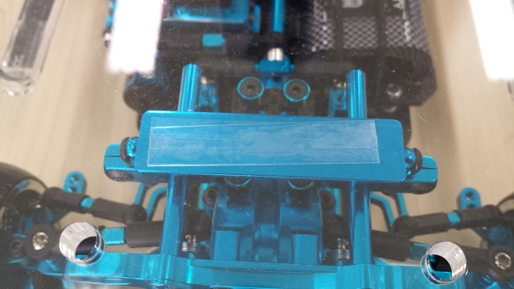
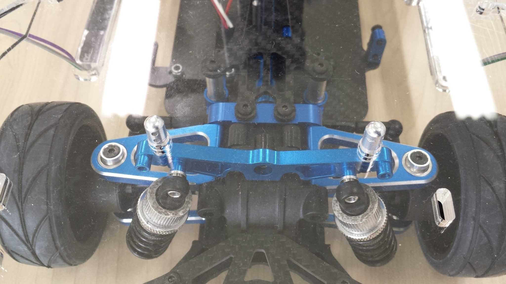
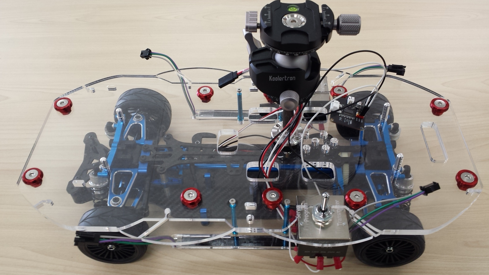

# ラジコンの荷台

## 【荷台】
前後共に、 
「イーグル模型 アジャスタブル・ステルスボディマウント[ライトブルー] BM-01-LBL」 
のリア用パーツをダンパーステーに装着して、その上にアクリル製プレート4mmを2枚重ねて載せています。 
セロハンテープで接着しています。 

 
 
 
 
 

ダンパーステーにボディマウントがある車両の場合は、それを利用します。 
 
 

