# 制御システム

## 【画像】
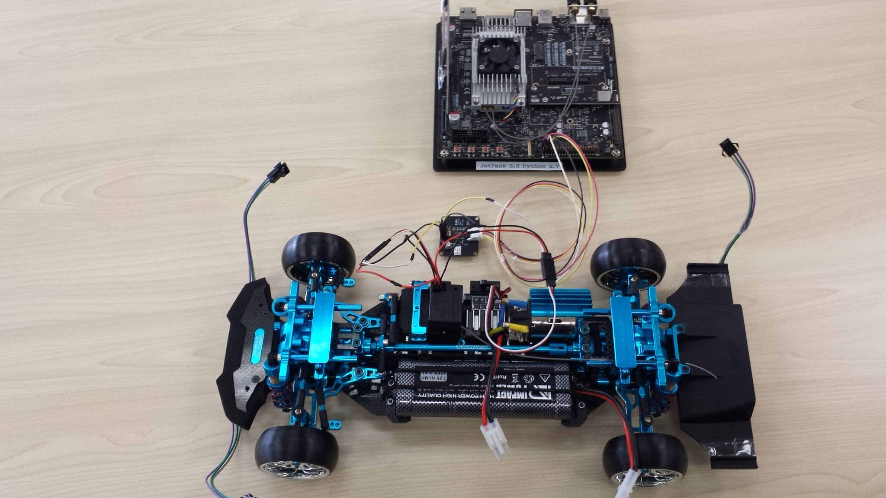

## 【制御システム】
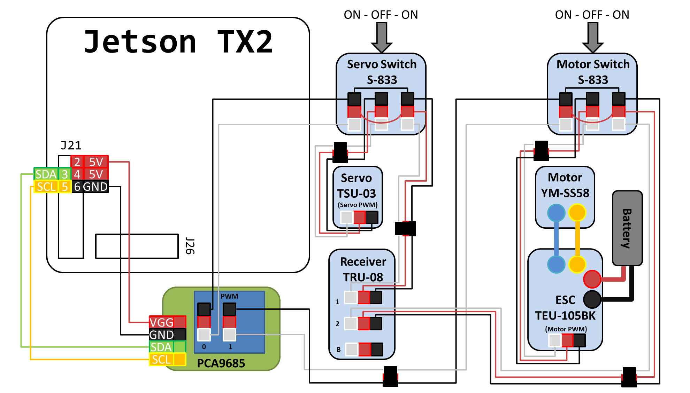

### PCA9685
サーボとモーターのPWM制御のために、PCA9685の基板を用意します。 
Adafruit,秋月,Fabo等、どれでも可能です。 
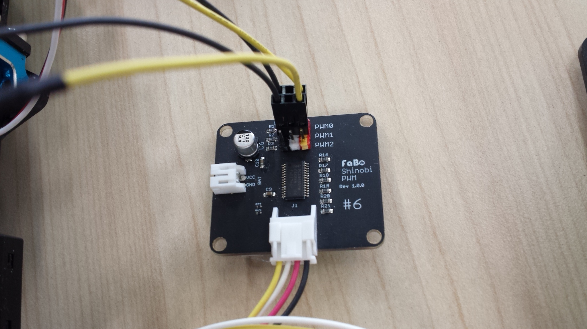 
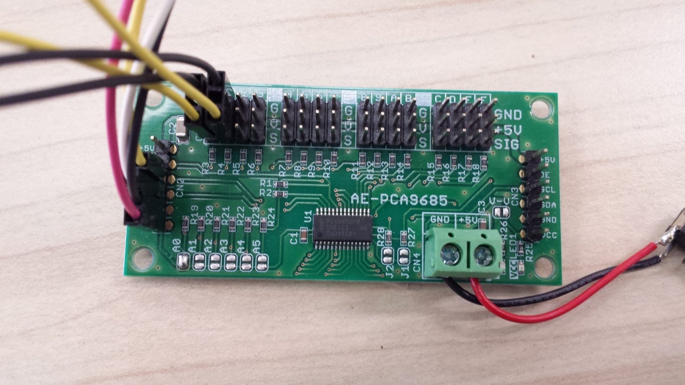 

### 配線
ラジコンとしての配線は以下の通りです。 
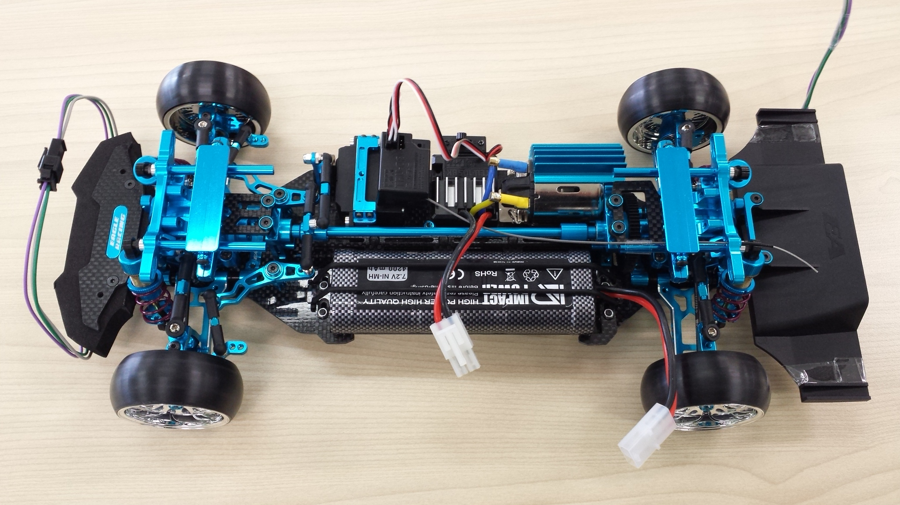 
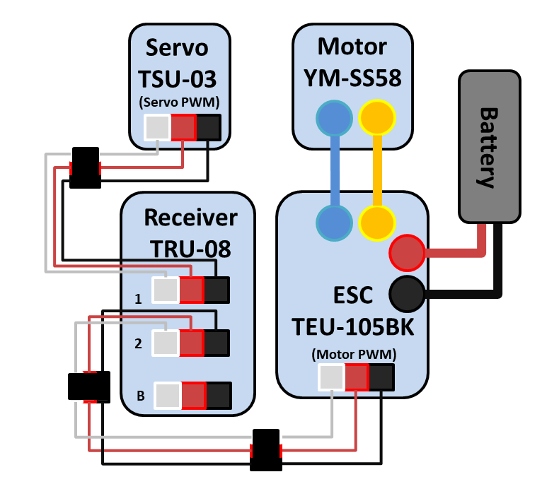 

プログラム制御時の配線は以下の通りです。 

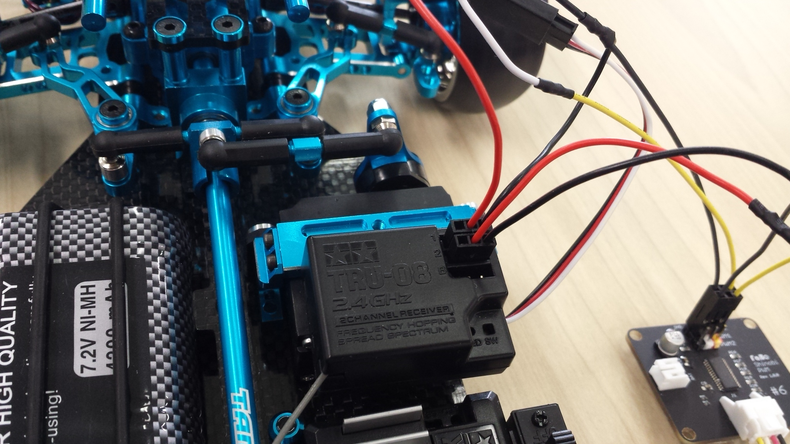
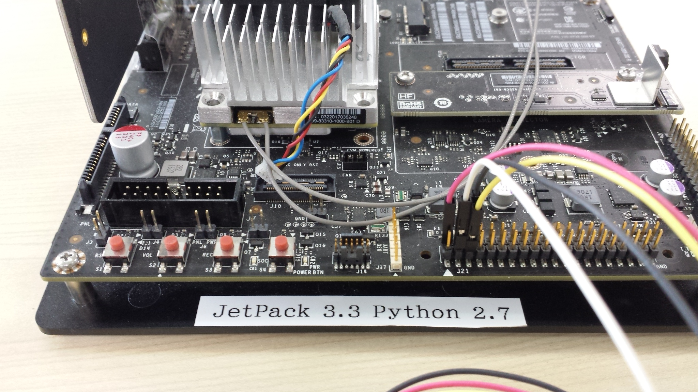
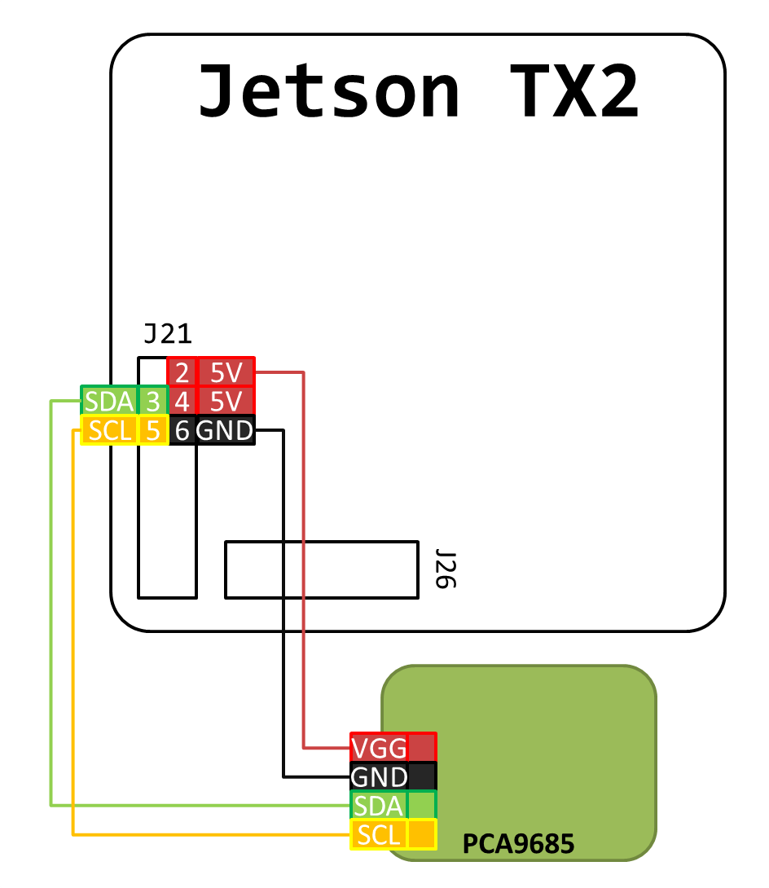 
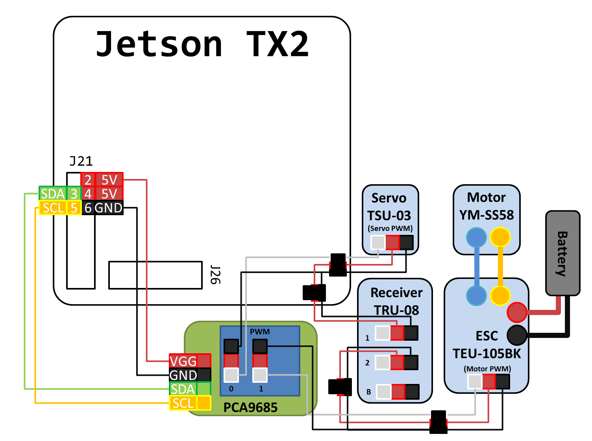 

3極 ON-OFF-ON トグルスイッチを使う時の配線は以下の通りです。 
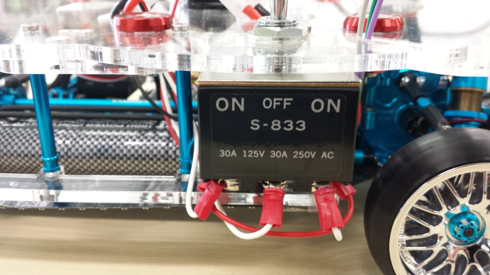 
 
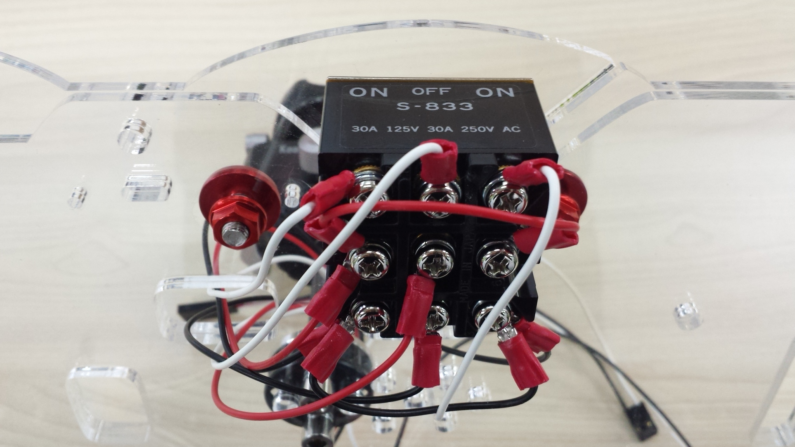 
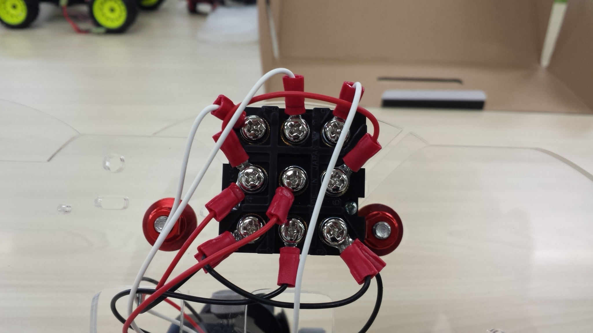 

### スイッチ
荷台を置くと、配線の入れ替えが出来なくなるため、3極ON-OFF-ONのトグルスイッチを用意します。 
大電流が流れるわけではないので、小さいスイッチでもいいかもしれません。 
 

## 【バッテリー】
PC用の12Vモバイルバッテリーを利用します。 
画像のバッテリーはサンワサプライ 700-BTL012BKです。 
バッテリーは、Jetson TX2とVelodyne VLP-16の入力電圧にあった出力が可能な物を選択します。 
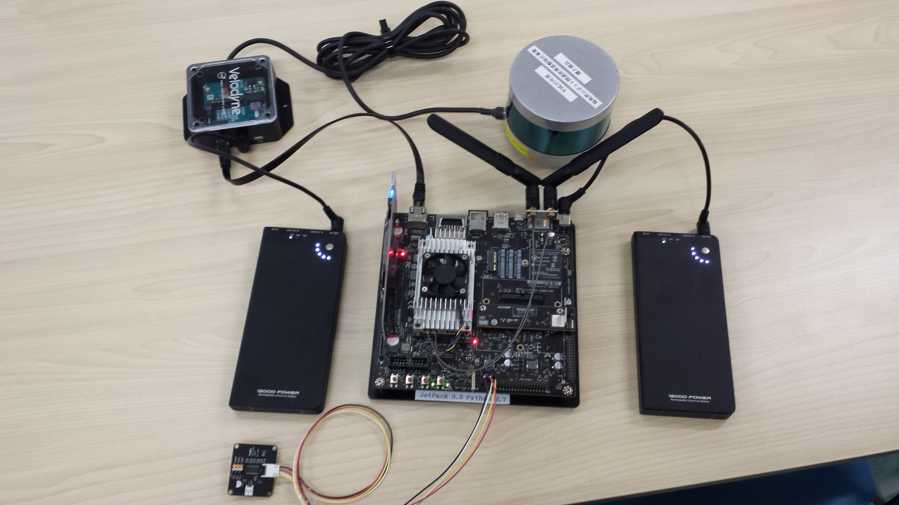 

## 【Velodyne VLP-16】
この構成の中で最も高価なものが距離センサーのVelodyne VLP-16です。 
Autowareではこのセンサーを使います。 
 

